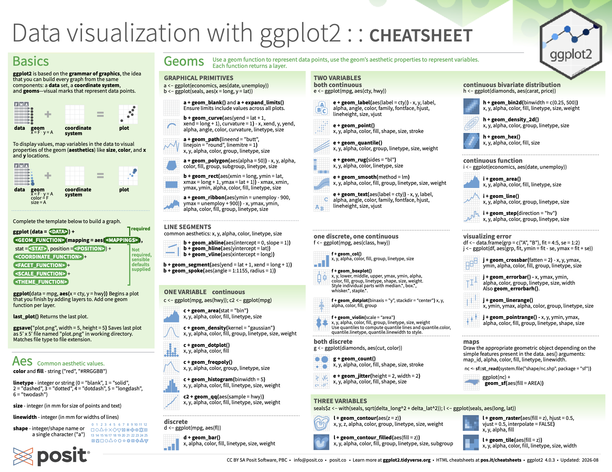
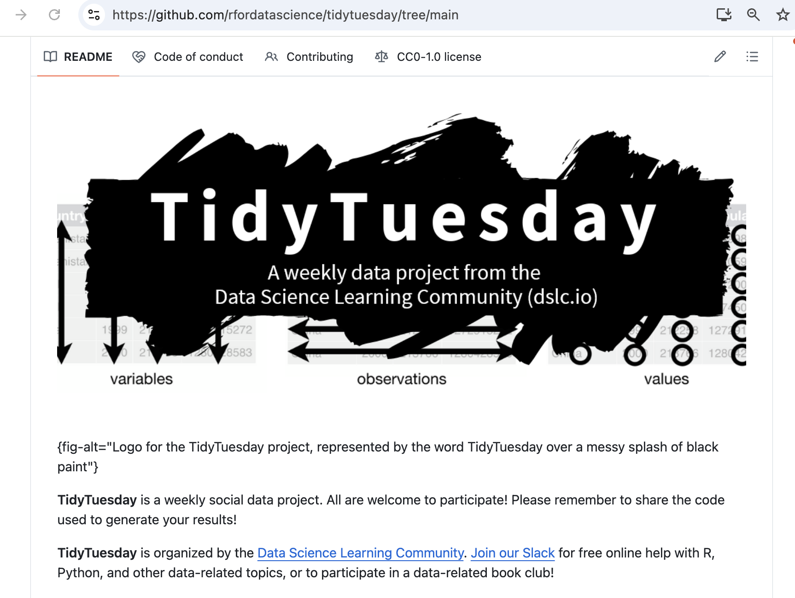
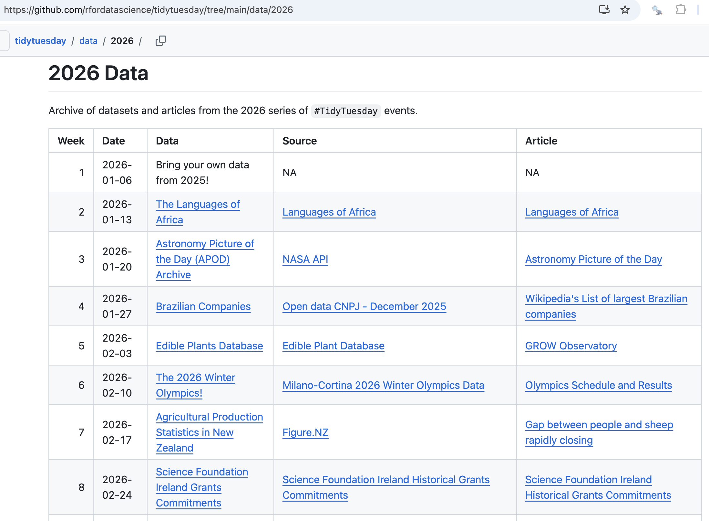
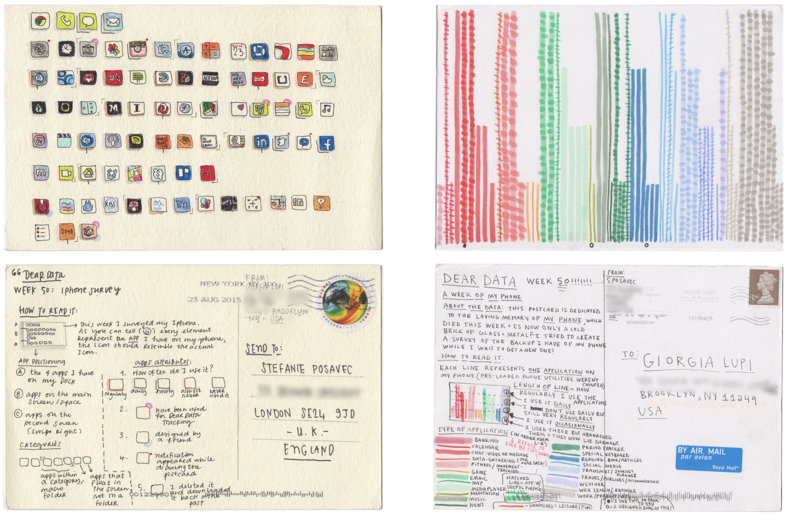
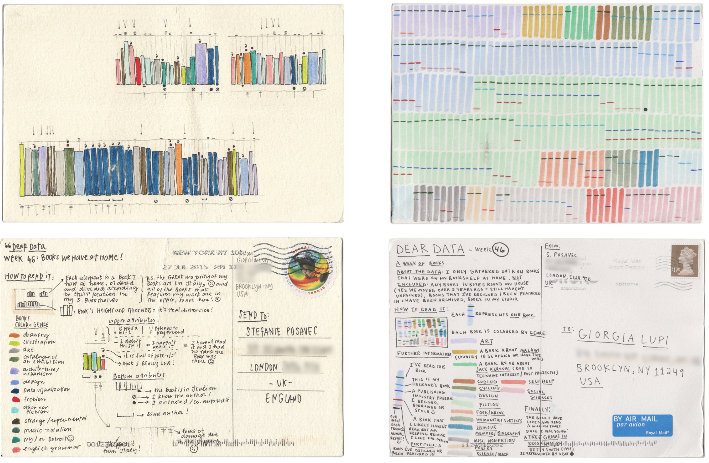
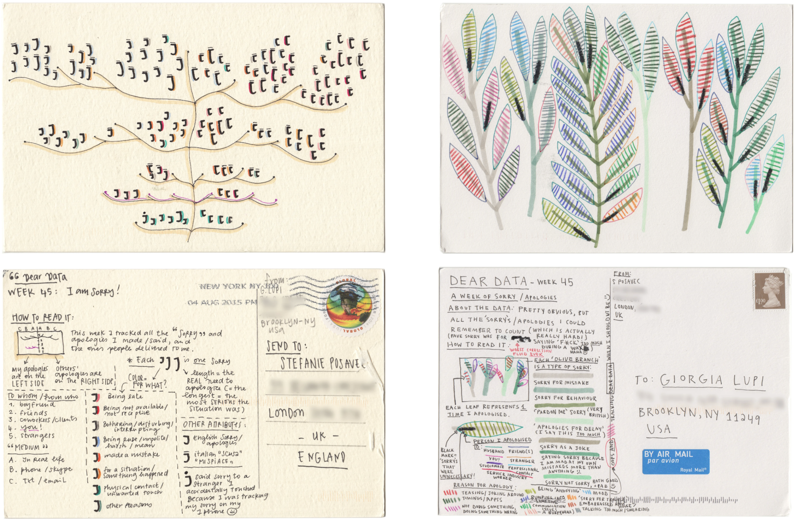
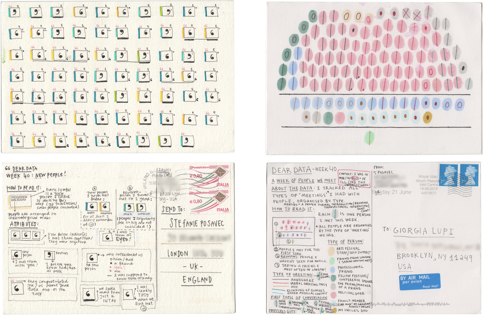
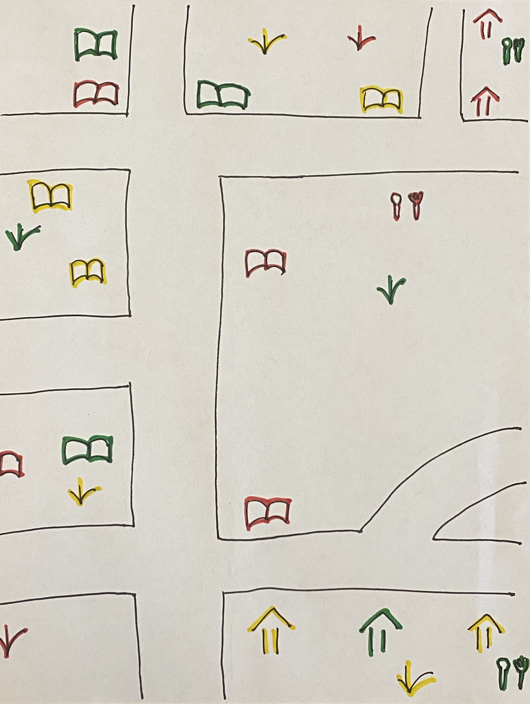
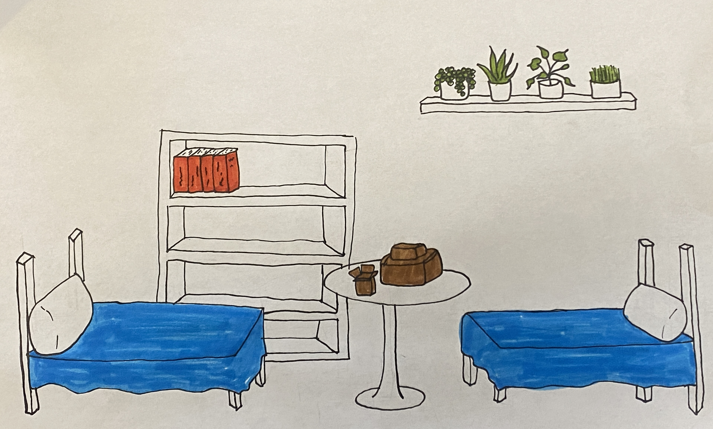

```{r include=FALSE}
library(tidyverse)
library(mosaic)
library(knitr)
library(ggthemes)
options(pillar.width = 70)
theme_set(theme_gray())
```


## What and why

-   Data visualization is the process of transforming raw data into visual formats, like **charts**, **graphs**, or **maps**, to make it easier to understand and interpret

-   Communicate results **clearly** and **effectively**

-   Supports evidence-based decisions across many fields.

## What is **ggplot2**?

-   **ggplot2** is an R package for data visualization
-   Encoded functions for numerous different plot types
-   Builds plots in layers using `+`

## Basic structure of a ggplot


```{r}
#| echo: true
#| eval: false
#| code-line-numbers: "2|3|4|5"

# General structure
ggplot(data = ..., aes(x = ..., y = ...)) +
  geom_*() +
  labs("label for you plot and axes")
      
```


## Births in 2015

```{r}
library(mosaic)
Births2015
```

Obtained from the National Center for Health Statistics, National Vital Statistics System, 2015 data.


## How do we make this plot?
   
:::: {.columns} 
::: {.column width="50%"}
```{r}
#| echo: false
ggplot(
  data = Births2015,
  aes(x = date, y = births)
) +
  geom_point() +
  labs(title = "US Births in 2015")
```
:::

::: {.column width="50%"}
Two Questions:

 1. What do we want the computer to do?  (What is the goal?)
 
 2. What does the comptuer need to know?
:::
::::


## How do we make this plot?
   
:::: {.columns} 
::: {.column width="50%"}
```{r}
#| echo: false
ggplot(
  data = Births2015,
  aes(x = date, y = births)
) +
  geom_point() +
  labs(title = "US Births in 2015")
```
:::

::: {.column width="50%"}
1. Goal: scatterplot = a plot with points
 
2. What does the computer need to know?
 
    * data source: `Births2015`

    * aesthetics: 
 
        * `date -> x`
        * `births -> y`

    * points
:::
::::

## How do we make this plot?
   
:::: {.columns} 
::: {.column width="50%"}
```{r}
#| echo: false
ggplot(
  data = Births2015,
  aes(x = date, y = births)
) +
  geom_point() +
  labs(title = "US Births in 2015")
```
:::

::: {.column width="50%"}
```{r}
#| echo: true
#| eval: false
#| code-line-numbers: "1,2,3,9,10,11"

# fmt: skip

ggplot(data = Births2015,
       aes(x = date, y = births)
) +
  geom_point() +
  labs(title = "US Births in 2015")

ggplot() +
  geom_point(
    data = Births2015,
    aes(x = date, y = births)
  ) +
  labs(title = "US Births in 2015")
```

:::
::::

## Layers: layer 0 

:::: {.columns} 
::: {.column width="40%"}
```{r}
#| echo: false
ggplot()
```
:::

::: {.column width="60%"}
```{r}
#| echo: true
#| eval: false
#| code-line-numbers: "1"
ggplot()
```

:::
::::

## Layers: layer 1 

:::: {.columns} 
::: {.column width="40%"}
```{r, echo=FALSE}
ggplot(data = Births2015, aes(x = date, y = births))
```
:::

::: {.column width="60%"}
```{r}
#| echo: true
#| eval: false
#| code-line-numbers: "2,3"
ggplot(
  data = Births2015,
  aes(x = date, y = births)
)
```

:::
::::

## Layers: layer 2 

:::: {.columns} 
::: {.column width="40%"}
```{r, echo=FALSE}
ggplot(
  data = Births2015,
  aes(x = date, y = births)
) +
  geom_point()
```
:::

::: {.column width="60%"}
```{r}
#| echo: true
#| eval: false
#| code-line-numbers: "5"
ggplot(
  data = Births2015,
  aes(x = date, y = births)
) +
  geom_point()
```

:::
::::


## Layers: layer 3 

:::: {.columns} 
::: {.column width="40%"}
```{r, echo=FALSE}
ggplot(
  data = Births2015,
  aes(x = date, y = births)
) +
  geom_point() +
  labs(title = "US Births in 2015")
```
:::

::: {.column width="60%"}
```{r}
#| echo: true
#| eval: false
#| code-line-numbers: "6"
ggplot(
  data = Births2015,
  aes(x = date, y = births)
) +
  geom_point() +
  labs(title = "US Births in 2015")
```

:::
::::


## How do we make this plot?
    
:::: {.columns} 
::: {.column width="50%"}
```{r, echo=FALSE}
ggplot(data = Births2015) +
  geom_point(
    aes(x = date, y = births, color = wday)
  ) +
  labs(title = "US Births in 2015")
```
:::

::: {.column width="50%"}
What has changed?  

 * new aesthetic: mapping color to day of week

:::
::::

## How do we make this plot?
    
:::: {.columns} 
::: {.column width="50%"}
```{r, echo=FALSE}
ggplot(data = Births2015) +
  geom_point(
    aes(x = date, y = births, color = wday)
  ) +
  labs(title = "US Births in 2015")
```
:::

::: {.column width="50%"}
```{r}
#| echo: true
#| eval: false
#| code-line-numbers: "6"
ggplot(
  data = Births2015,
  aes(
    x = date,
    y = births,
    color = wday
  )
) +
  geom_point() +
  labs(title = "US Births in 2015")
```
:::
::::

## How do we make this plot?
    
:::: {.columns} 
::: {.column width="50%"}
```{r, echo=FALSE}
ggplot(data = Births2015) +
  geom_line(
    aes(x = date, y = births, color = wday)
  ) +
  labs(title = "US Births in 2015")
```
:::
::::

## How do we make this plot?
    
:::: {.columns} 
::: {.column width="50%"}
```{r, echo=FALSE}
ggplot(data = Births2015) +
  geom_line(aes(x = date, y = births, color = wday)) +
  labs(title = "US Births in 2015")
```
:::

::: {.column width="50%"}
lines instead of dots!

```{r}
#| echo: true
#| eval: false
#| code-line-numbers: "9"
ggplot(
  data = Births2015,
  aes(
    x = date,
    y = births,
    color = wday
  )
) +
  geom_line() +
  labs(title = "US Births in 2015")
```

:::
::::

## How do we make this plot?
    
:::: {.columns} 
::: {.column width="50%"}
```{r, echo=FALSE}
ggplot(
  data = Births2015,
  aes(x = date, y = births, color = wday)
) +
  geom_point() +
  geom_line() +
  labs(title = "US Births in 2015")
```
:::
::::

## How do we make this plot?
    
:::: {.columns} 
::: {.column width="50%"}
```{r}
#| echo: false
ggplot(
  data = Births2015,
  aes(x = date, y = births, color = wday)
) +
  geom_point() +
  geom_line() +
  labs(title = "US Births in 2015")
```
:::

::: {.column width="50%"}
Now there are two **layers**: one with points and one with
lines

```{r}
#| echo: true
#| eval: false
#| code-line-numbers: "9,10"
ggplot(
  data = Births2015,
  aes(
    x = date,
    y = births,
    color = wday
  )
) +
  geom_point() +
  geom_line() +
  labs(title = "US Births in 2015")
```


 <!--*  The layers are placed one on top of the other:  the points 
are *below* and the lines are *above*.   

 * `data` and `aes` specified in `ggplot()` affect all geoms-->
:::
::::


## What does this code do?
  

```{r}
#| echo: true
#| eval: false
#| code-line-numbers: "6"
ggplot(
  data = Births2015,
  aes(
    x = date,
    y = births,
    color = "navy"
  )
) +
  geom_point() +
  labs(title = "US Births in 2015")
```


## What does this code do?

```{r}
#| echo: true
#| eval: true
#| code-line-numbers: "3"
ggplot(
  data = Births2015,
  aes(x = date, y = births, color = "navy")
) +
  geom_point() +
  labs(title = "US Births in 2015")
```


The code *mapped* the color aesthetic to a **new variable** with only one value ("navy").  
All the dots get set to the same color, but it's not navy.


## Setting vs. Mapping

*setting* the color to be navy for all of the dots is done **outside** the `aes()` designation:

```{r}
#| echo: true
#| eval: true
#| code-line-numbers: "4,5"

# fmt: skip

ggplot(
  data = Births2015,
  aes(x = date, y = births)) + # map variables
  geom_point(color = "navy") # set attributes
```


## How do we make this plot?
    
:::: {.columns} 
::: {.column width="50%"}
```{r, echo=FALSE}
ggplot(
  data = Births2015,
  aes(x = date, y = births)
) +
  geom_line(aes(color = wday)) +
  geom_point(color = "navy") +
  labs(title = "US Births in 2015")
```
:::
::::

## How do we make this plot?
    
:::: {.columns} 
::: {.column width="50%"}
```{r, echo=FALSE}
ggplot(
  data = Births2015,
  aes(x = date, y = births)
) +
  geom_line(aes(color = wday)) +
  geom_point(color = "navy") +
  labs(title = "US Births in 2015")
```
:::

::: {.column width="50%"}
```{r}
#| echo: true
#| eval: false
#| code-line-numbers: "5,6"
ggplot(
  data = Births2015,
  aes(x = date, y = births)
) +
  geom_line(aes(color = wday)) +
  geom_point(color = "navy") +
  labs(title = "US Births in 2015")
```


:::
::::

## `geom_*()` types
 
```{r, echo=TRUE, comment=NA}
apropos("^geom_")
```

## `geom_*()` pics



<a href = "https://ggplot2.tidyverse.org/" target = "_blank">https://ggplot2.tidyverse.org/</a>


## What makes a plot good? 

Most (all?) graphics are intended to help us make comparisons

* How does something change over time?
* Do my treatments matter?  How much?
* Do treatment and control respond the same way?

::: {.callout-important}
# Key plot metric
Does my plot make the comparisons I am interested in:

* easily, and 
* accurately?
:::


# TidyTuesday

```{r fig.cap = "Image credit: https://github.com/rfordatascience/tidytuesday", out.width='90%', fig.align='center', echo=FALSE}

```

## TidyTuesday data

```{r fig.cap = "Image credit: https://github.com/rfordatascience/tidytuesday/tree/main/data/2026", out.width='90%', fig.align='center', echo=FALSE}

```

## TidyTuesday at Pomona

* Every Tuesday from 11-1pm (starting September 22, 2026)
* Estella 2131
* Open to beginners... but come with a curious mindset and ask lots of questions!
* The task will be to make a graphic (usually)

## Past TidyTuesday

```{r}
#| message: false
#| warning: false
#| echo: false
#| fig.cap: 'image credit: https://hardin47.github.io/TidyTuesday/'

img1 <- cowplot::ggdraw() + cowplot::draw_image("images/allrecipes.jpg")
img2 <- cowplot::ggdraw() + cowplot::draw_image("images/chess.png")
img3 <- cowplot::ggdraw() + cowplot::draw_image("images/climate.png")
img4 <- cowplot::ggdraw() + cowplot::draw_image("images/cranes.png")
img5 <- cowplot::ggdraw() + cowplot::draw_image("images/euroleague.png")
img6 <- cowplot::ggdraw() + cowplot::draw_image("images/literary_prize.png")

patchwork::wrap_plots(img1, img2, img3, img4, img5, img6, ncol = 3)
```

# Data science minor @ Pomona

## Courses


:::: {.columns}

::: {.column width="50%"}
* introduction to statistics
* computer science
* linear algebra
* foundations of data science
* ethics in data science
:::

::: {.column width="50%"}
* one upper division course
* capstone project (0.5 units, fall senior year)
:::

::::

## Important considerations

* You **must** be done with the 5 lower division courses by the end of your junior spring.
* You **must** have a faculty member in a discipline outside of mathematics / statistics / computer science to supervise the capstone project.

* Check out these <a href = "https://www.pomona.edu/academics/departments/data-science/frequently-asked-questions" target = "_blank">FAQ: https://www.pomona.edu/academics/departments/data-science/frequently-asked-questions</a>.

# Dear Data

* Year-long project by Giorgia Lupi and Stefanie Posavec
* 52 weeks of postcards each with a different topic

# A week of phones

```{r fig.cap = "Image credit: https://www.dear-data.com/", out.width='100%', fig.align='center', echo=FALSE}

```


# A week of books

```{r fig.cap = "Image credit: https://www.dear-data.com/", out.width='100%', fig.align='center', echo=FALSE}

```


# A week of apologies

```{r fig.cap = "Image credit: https://www.dear-data.com/", out.width='100%', fig.align='center', echo=FALSE}

```


# A week of meetings

```{r fig.cap = "Image credit: https://www.dear-data.com/", out.width='100%', fig.align='center', echo=FALSE}

```


# A week of spaces

```{r fig.cap = "Image credit: Frances Heitkemper", out.width='100%', fig.align='center', echo=FALSE}

```

# A week of spaces

```{r fig.cap = "Image credit: Frances Heitkemper", out.width='100%', fig.align='center', echo=FALSE}

```


# Your turn

For the next 5 minutes, in your zine, visualize the spaces you've encountered this week. 

Be creative!

# Thank you

